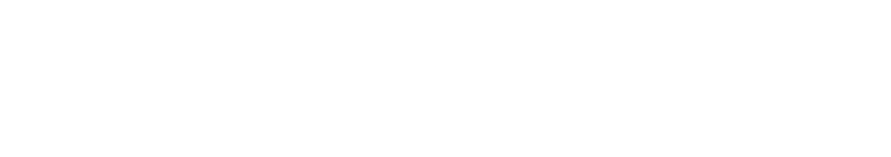
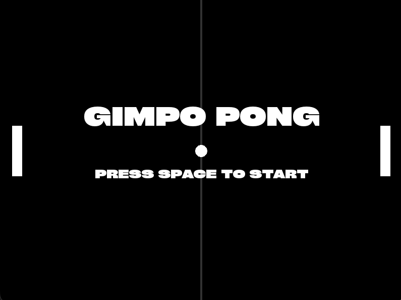
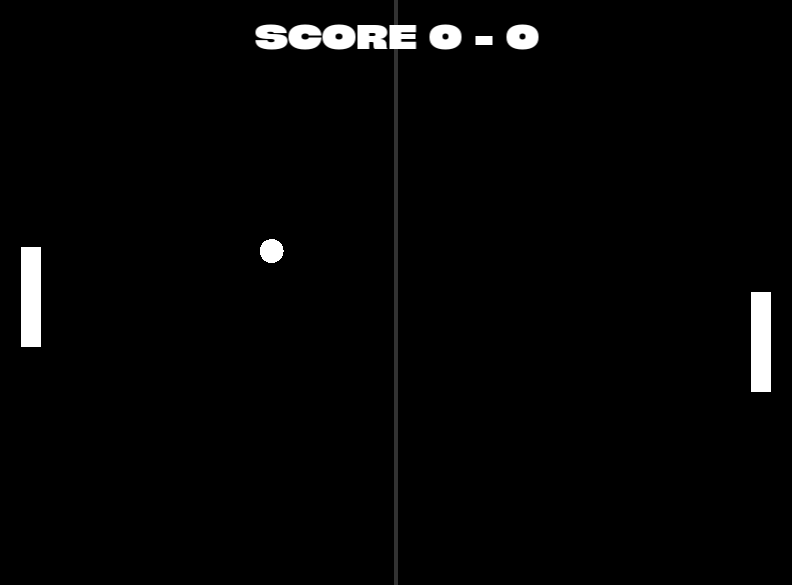
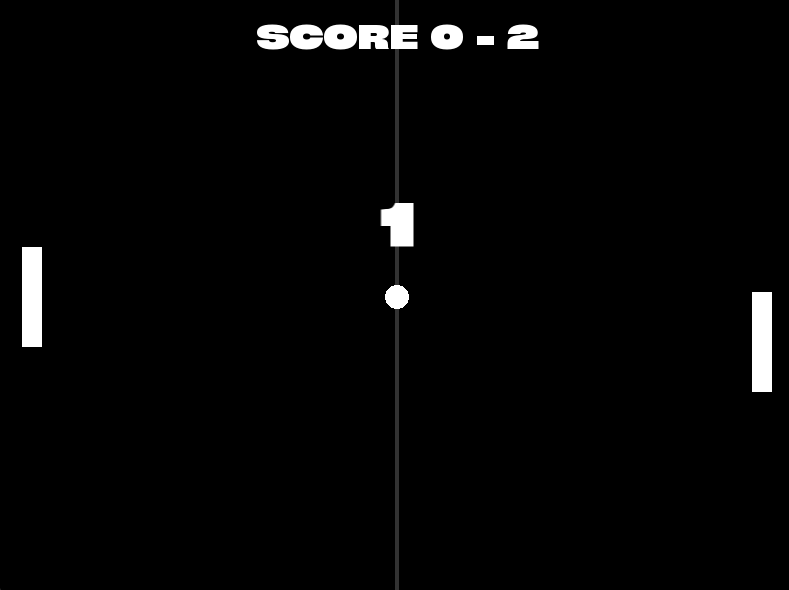

# Gimpo

> A simple SFML-based classic ping pong game.

---

## About

Gimpo is a classic Pong-style game built with **C++ and SFML**.

It features a simple two-player mode alongside an AI opponent, with responsive paddle controls, ball physics, scoring, and a countdown system.

---

## Gallery

https://github.com/user-attachments/assets/cdd7d64d-b3e8-4cc5-98a3-4275dbc67dd9

---

## Features

- Player vs Player
- Player vs AI
- Ball and paddle Physics
- Retro inspired
- Built with SFML 3

---

## Controls

|Key|Action|
|----|----|
|`W` / `S`|Move left paddle|
|`↑` / `↓`|Move right paddle|
|`Space`| Start game|
|`Escape`|Exit|

---

Made with C++, SFML, and a passion for games.

With love ❤️ ~ Azmeer Pirani
