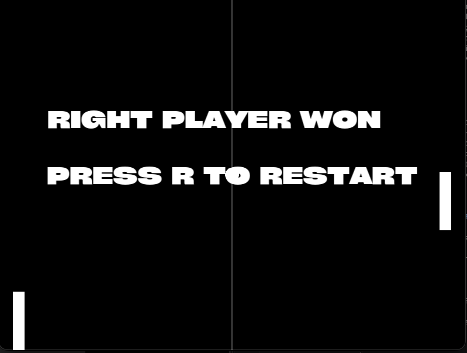

# Gimpo

> A simple SFML-based classic ping pong game.

---

## About

Gimpo is a classic Pong-style game built with **C++ and SFML**.

It features a simple two-player mode alongside an AI opponent, with responsive paddle controls, ball physics, scoring, and a countdown system.

---

## Gallery

---

## Features

Player vs Player
Player vs AI
Ball and paddle Physics
Retro inspired
Built with SFML 3

---

## Controls

|Key|Action|
|----|----|
|`W` / `S`|Move left paddle|
|`↑` / `↓`|Move right paddle|
|`Space`| Start game|
|`Escape`|Exit|

---

Made with C++, SFML, and a passion for games.

With love ❤️ ~ Azmeer Pirani